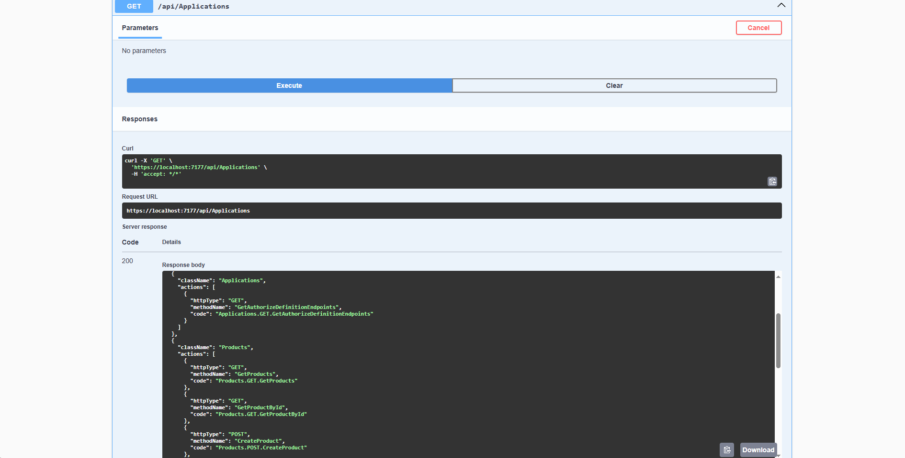

# 🔐 Identity with JWT Test Project — ASP.NET Core Authentication & Authorization

<br>

[](../../issues/new?labels=bug)
[](../../issues/new?labels=enhancement)

<br>

## 📌 Project Overview

Identity with JWT Test Project demonstrates how to implement **secure user authentication and authorization** in ASP.NET Core using **ASP.NET Identity** and **JSON Web Tokens (JWT)**.  
Custom attributes and **role-based access control** are applied to protect API endpoints and manage user permissions.  
In this structure, **users are assigned specific roles**, and **each controller method is decorated with attributes that define which roles can access it**. This ensures that, at runtime, users without the required role are **automatically restricted** from reaching protected endpoints.

This project was developed by following the **Angular E-Commerce Course by Gencay Yıldız** on YouTube, which provided valuable guidance on building a secure and scalable system.  
> 👉 Only the **backend** has been implemented. The **frontend part was not applied** in this project.

<br>

## ✨ Features

- **User Registration** — New users can register through the Identity system  
- **Role Management** — Admins assign permissions to roles, defining accessible attributes  
- **Role-Based Authorization** — Each method is annotated with allowed roles using attributes, and users are granted or denied access accordingly  
- **JWT Authentication** — Token-based session handling for secure requests  
- **Custom Attributes** — Fine-grained authorization beyond simple role checks

<br>

## 🖼️ Screenshots
Shown below in order:  
**1. All-Attributes**

<p align="center">
  
  
  
</p>

<br>

## 🧰 Tech Stack

<p>
  
  
  
</p>

<br>

## 📥 Installation

### Prerequisites
- .NET SDK 7.0+  
- SQL Server (local or remote)

### Setup
```bash
git clone [repository-url]
cd IdentityWithJwtTestProject

dotnet restore
dotnet ef database update   # Apply migrations
dotnet run
```

The API will be available at `https://localhost:5001` by default.  
Register a user, assign roles through the database or API, then test authenticated endpoints with your issued JWT.

<br>

## 📜 License

[](LICENSE)

This project is licensed under the terms described in the [LICENSE](./LICENSE) file.

---

© 2025 Yusuf Okan Sirkeci — [Hereetria](https://github.com/Hereetria)
